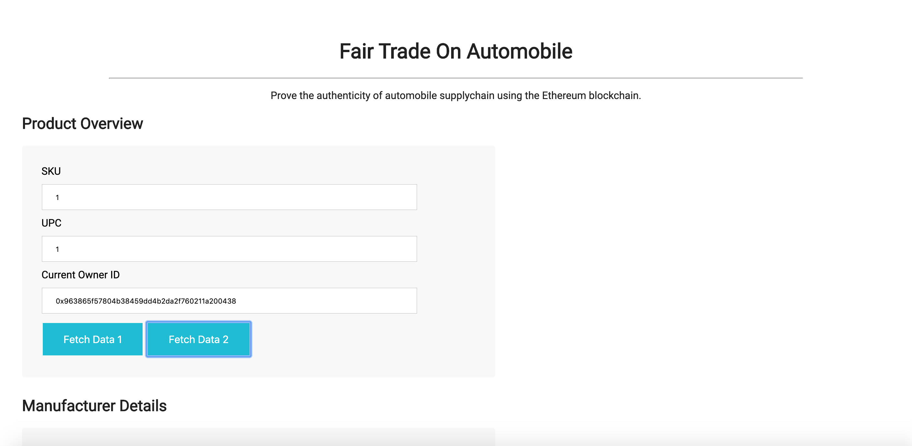
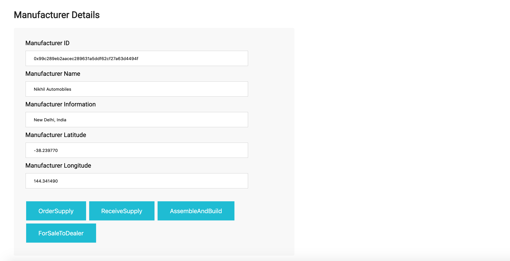
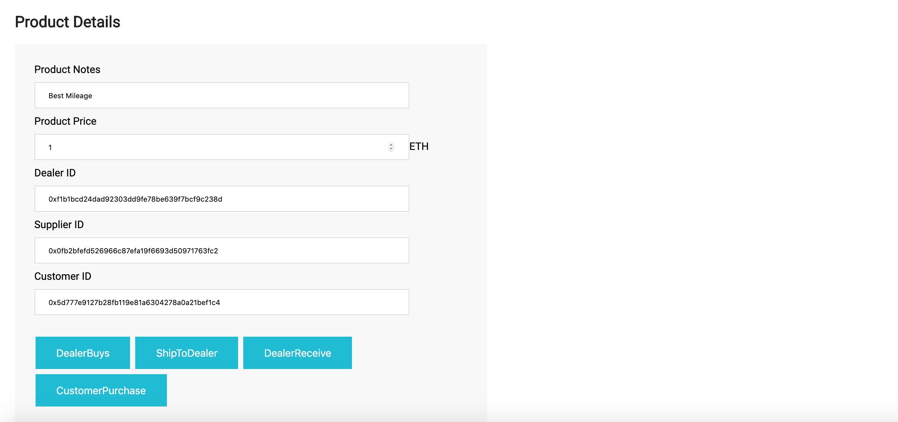
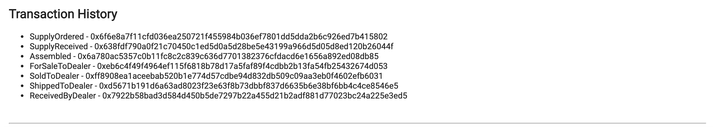
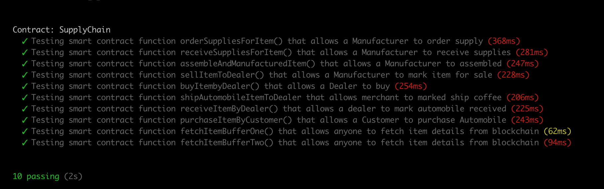

# Supply chain & data auditing For Automobile Industry

This repository containts an Ethereum DApp that demonstrates a Supply Chain flow in Automobile Industry. The user story is similar to any commonly used supply chain process. A Manufacturer get supplies for automobile and build, assemble and manufacture. Then sell it is sold to dealer and purchased by a Customer.

The DApp User Interface when running should look like...










## Wallet Address 
https://rinkeby.etherscan.io/address/0xA896791dE26fFA7e44b1e6AfCf01DB66e20C845C

## Contract Address 
https://rinkeby.etherscan.io/tx/0x7922b58bad3d584d450b5de7297b22a455d21b2adf881d77023bc24a225e3ed5

## Versions 
* Truffle v5.1.14-nodeLTS.0 (core: 5.1.13)
* Solidity - ^0.4.24 (solc-js)
* Node v10.16.0
* Web3.js v1.2.1

## Getting Started

These instructions will get you a copy of the project up and running on your local machine for development and testing purposes. See deployment for notes on how to deploy the project on a live system.

### Prerequisites

Please make sure you've already installed ganache-cli, Truffle and enabled MetaMask extension in your browser.

```
Give examples (to be clarified)
```

### Installing

A step by step series of examples that tell you have to get a development env running

Clone this repository:

```
git clone https://github.com/udacity/nd1309/tree/master/course-5/project-6
```

Change directory to ```project-6``` folder and install all requisite npm packages (as listed in ```package.json```):

```
cd project-6
npm install
```

Launch Ganache:

```
ganache-cli -m "spirit supply whale amount human item harsh scare congress discover talent hamster"
```

Your terminal should look something like this:


In a separate terminal window, Compile smart contracts:

```
truffle compile
```

Your terminal should look something like this:


This will create the smart contract artifacts in folder ```build\contracts```.

Migrate smart contracts to the locally running blockchain, ganache-cli:

```
truffle migrate
```

Your terminal should look something like this:


Test smart contracts:

```
truffle test
```

All 10 tests should pass.



In a separate terminal window, launch the DApp:

```
npm run dev
```

## Built With

* [Ethereum](https://www.ethereum.org/) - Ethereum is a decentralized platform that runs smart contracts
* [IPFS](https://ipfs.io/) - IPFS is the Distributed Web | A peer-to-peer hypermedia protocol
to make the web faster, safer, and more open.
* [Truffle Framework](http://truffleframework.com/) - Truffle is the most popular development framework for Ethereum with a mission to make your life a whole lot easier.


## Authors

See also the list of [contributors](https://github.com/your/project/contributors.md) who participated in this project.

## Acknowledgments

* Solidity
* Ganache-cli
* Truffle
* IPFS
